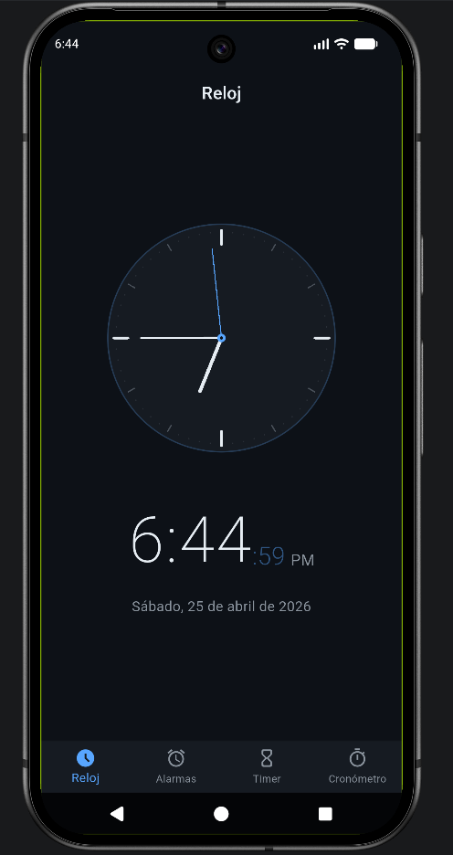
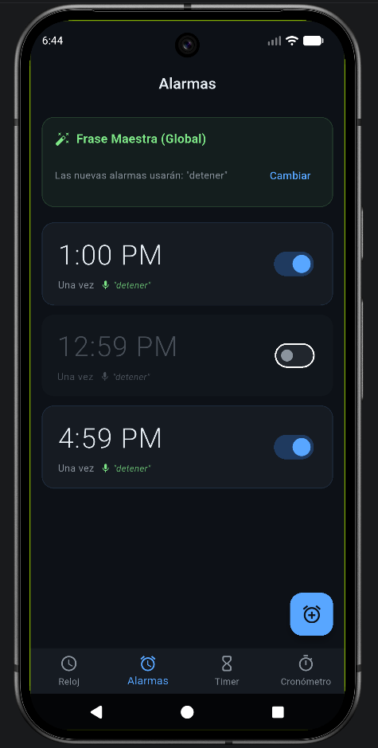
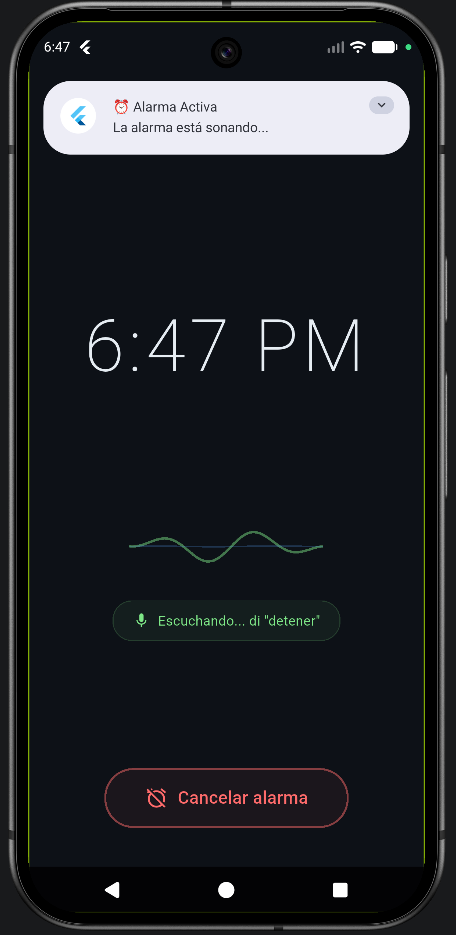
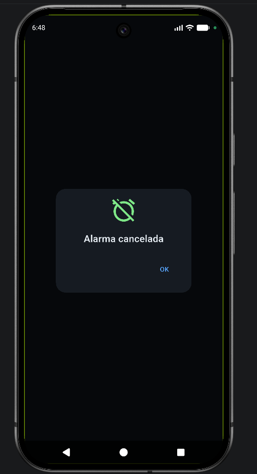
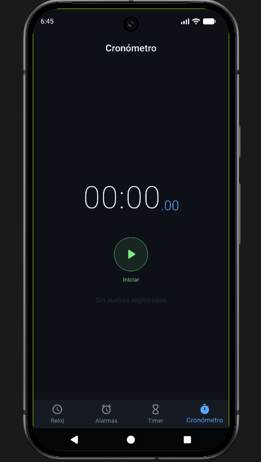
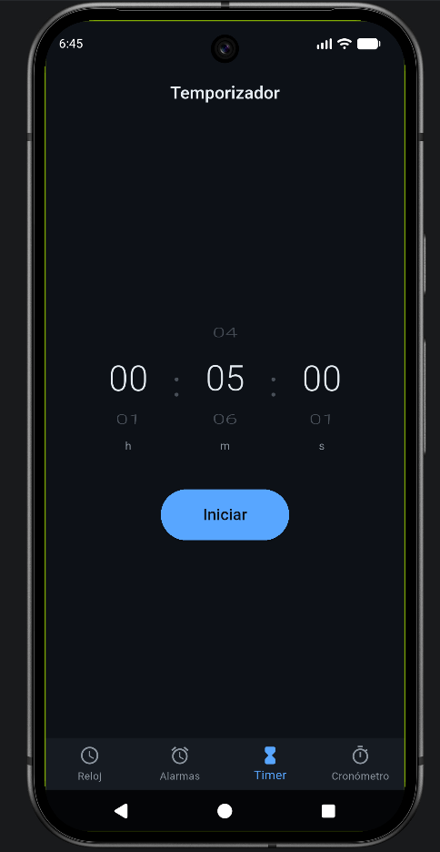

# 🕒 Alarm & Clock Pro


Una aplicación de alarma y reloj desarrollada en Flutter, diseñada para ser rápida y fácil de usar. Su principal ventaja es que **puedes apagar la alarma usando solo tu voz**, ideal para no tener que buscar el teléfono cuando te acabas de despertar.

---

## ✨ Características Principales

### 🎙️ Control por Voz
- **Una sola frase para todo:** Configura una palabra (por ejemplo, "detener" o "ya desperté") y la aplicación la usará automáticamente para todas tus alarmas nuevas.
- **Escucha continua:** El micrófono te escucha mientras suena la alarma (el sonido), por lo que puedes dar la orden sin tener que pausar nada.
- **Micrófono siempre atento:** El sistema se asegura de que el micrófono no se apague mientras la alarma suena, garantizando que escuche tu orden en cualquier momento.
- **Cierre automático:** Cuando cancelas la alarma con tu voz, la pantalla te avisa que te escuchó y se cierra sola después de 5 segundos.

### 🔔 Alarmas Seguras
- **Funciona en pantallas bloqueadas:** La alarma encenderá la pantalla de tu teléfono incluso si está bloqueado, compatible con Android 13 y dispositivos Samsung.
- **A tu gusto:** Puedes ponerle nombre a cada alarma, elegir días específicos para que se repita y cambiar la frase para apagarla si no quieres usar la general.
- **Confiable:** Tu alarma sonará a la hora exacta, incluso si cierras la aplicación.

### 🕰️ Reloj y Utilidades
- **Diseño limpio:** Una interfaz en modo oscuro, muy cómoda para la vista.
- **Temporizador y Cronómetro:** Herramientas extra incluidas para medir el tiempo de forma sencilla.

---

## 🎨 Vistas de la Aplicación

<p align="center">
  
  
  
</p>
<p align="center">
  
  
  
</p>

*Diseño oscuro, simple y directo al grano, cubriendo todas las herramientas de tiempo que necesitas.*

---

## 🛠️ Cómo está construida

- **Estado de la App:** Usamos `Provider` para que la app sea rápida.
- **Audio:** Utilizamos `audioplayers` configurado de manera especial para que no choque con el micrófono.
- **Segundo Plano:** Las alarmas funcionan usando `flutter_foreground_task`.
- **Reconocimiento de Voz:** Usamos `speech_to_text` ajustado para escuchar comandos cortos rápidamente.
- **Guardado de Datos:** Todas tus alarmas se guardan en el teléfono usando `shared_preferences`.

---

## 🚀 Cómo instalarla

1. **Requisitos:**
   - Flutter SDK (^3.11.1)
   - Un teléfono Android (probado en Android 13+)

2. **Descargar y preparar:**
   ```bash
   git clone https://github.com/EduardoNaal/ITS_8vo_Moviles_Practica7_72574.git
   cd ITS_8vo_Moviles_Practica7_72574
   flutter pub get
   ```

3. **Ejecutar:**
   ```bash
   flutter run
   ```

> **IMPORTANTE:**
> Cuando abras la aplicación por primera vez, te pedirá permisos para usar el **Micrófono** y enviar **Notificaciones**. Es necesario aceptarlos para que el control por voz funcione correctamente.

---

## 💼 Por qué esta app es útil

**Alarm & Clock Pro** resuelve un problema muy común: la molestia de tener que abrir los ojos y tocar la pantalla para apagar el despertador en las mañanas. Al poder apagarla solo hablando, ofrece una comodidad que muchas aplicaciones de reloj por defecto no tienen, haciéndola muy atractiva para cualquier usuario.
