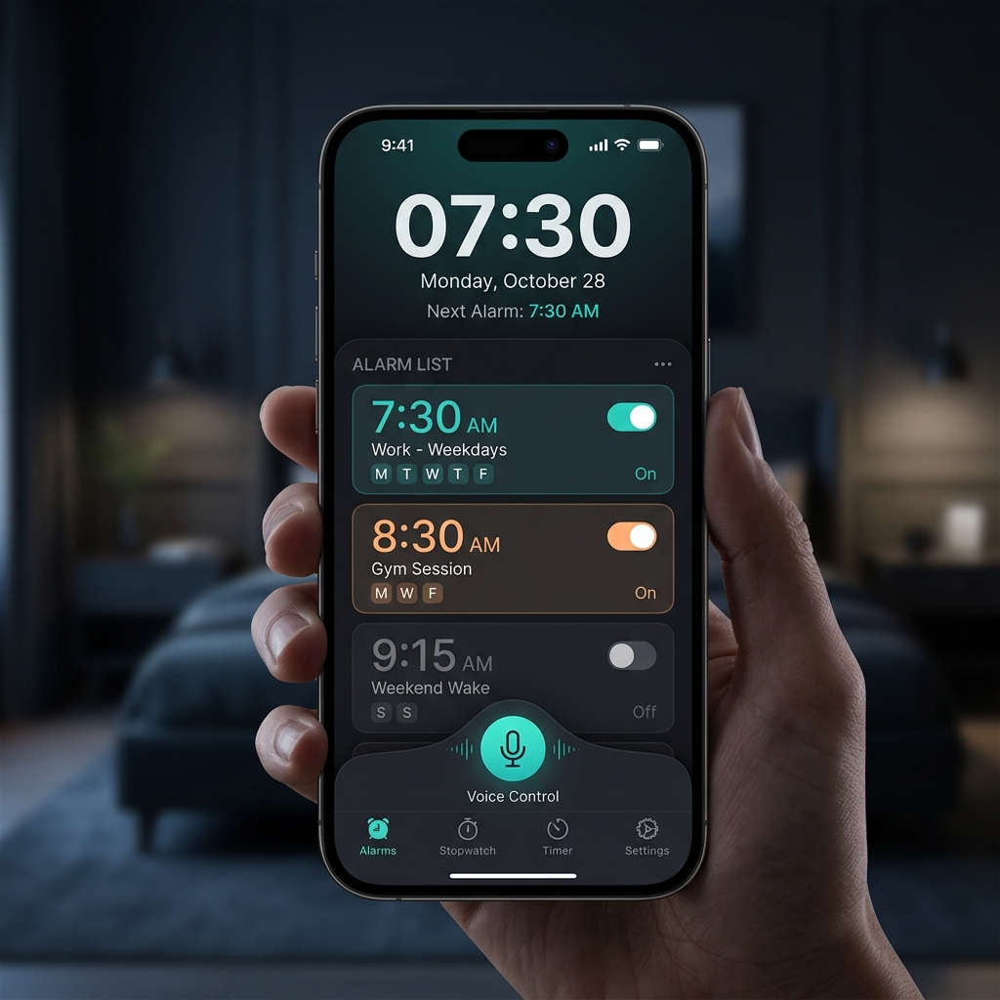

# 🕒 Alarm & Clock Pro - Práctica 7


Una aplicación de gestión del tiempo premium desarrollada en Flutter, diseñada para ofrecer una experiencia de usuario fluida y moderna. Este proyecto destaca por su innovador sistema de **cancelación de alarmas mediante comandos de voz**.

---

## ✨ Características Principales

### 🔔 Alarma Inteligente
- **Comandos de Voz:** Detén tus alarmas sin tocar el teléfono diciendo una palabra clave personalizada (ej. "detener", "silencio").
- **Personalización Total:** Configura etiquetas, tonos específicos y días de repetición.
- **Robustez:** Funciona en segundo plano y tras reiniciar el dispositivo gracias a servicios de primer plano.

### 🕰️ Reloj Digital
- Interfaz minimalista y elegante en modo oscuro que muestra la hora actual con precisión.

### ⏳ Temporizador & Cronómetro
- Herramientas integradas para medir intervalos de tiempo con precisión milimétrica.

---

## 🎨 Interfaz de Usuario

<p align="center">
  
</p>

*Mockup representativo de la estética premium de la aplicación.*

---

## 🛠️ Tecnologías y Librerías

- **Gestión de Estado:** `Provider`
- **Servicios de Fondo:** `flutter_foreground_task` y `android_alarm_manager_plus`
- **Reconocimiento de Voz:** `speech_to_text`
- **Audio & Vibración:** `audioplayers` y `vibration`
- **Persistencia:** `shared_preferences`

---

## 🚀 Instalación y Uso

1. **Prerrequisitos:**
   - Flutter SDK (^3.11.1)
   - Android Studio / VS Code con extensiones de Flutter.

2. **Clonar y configurar:**
   ```bash
   git clone <url-del-repositorio>
   cd alarm_app
   flutter pub get
   ```

3. **Ejecutar:**
   ```bash
   flutter run
   ```

> [!IMPORTANT]
> Para el correcto funcionamiento de los comandos de voz y las alarmas en Android 13+, asegúrate de otorgar los permisos de **Micrófono**, **Notificaciones** y **Alarmas Exactas** cuando la aplicación los solicite.

---

## 📂 Estructura del Proyecto

```text
lib/
├── models/         # Modelos de datos (AlarmModel)
├── providers/      # Lógica de negocio y estado (AlarmProvider)
├── screens/        # Vistas de la aplicación (Reloj, Alarma, etc.)
├── services/       # Servicios de almacenamiento, voz y scheduling
└── utils/          # Temas y constantes de diseño
```

---

## 🧪 Pruebas y Calidad

El proyecto incluye un plan detallado de pruebas documentado en `Reporte_Planificacion_Pruebas.md`, cubriendo:
- **Pruebas de Funcionalidad:** Validación del disparo de alarmas.
- **Pruebas de Usabilidad:** Evaluación de la facilidad de uso del comando de voz.
- **Seguridad:** Análisis de amenazas basado en el modelo STRIDE.

---

## 📝 Créditos

Desarrollado para la materia de **Dispositivos Móviles - 8vo Semestre**.
UAC - Práctica 7.
